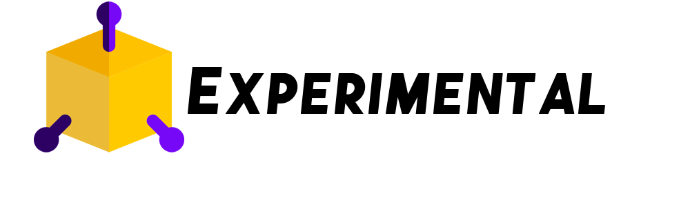

# AcademiaGeek | Curso de Desarrollo Web Front End.

   
 

  
  

    

 
<!-- TABLE OF CONTENTS -->

  
Tabla de contenido

  <ol>
    <li>
      <a href="#acerca-del-proyecto">Acerca del proyecto</a>
      <ul>
        <li><a href="#construido-con">Construido con</a></li>
      </ul>
    </li>
    <li>
      <a href="#para-comenzar">Para comenzar</a>
      <ul>
        <li><a href="#pre-requisitos">Pre-requisitos</a></li>
        <li><a href="#instalación">Instalación</a></li>
      </ul>
    </li>
    <li><a href="#autor">Autor</a></li>
  </ol>

## Acerca del proyecto

### Construido con

* [Bootstrap](https://getbootstrap.com)
* [Sass](https://sass-lang.com/guide)
* [NodeJs](https://nodejs.org/es/)
  
## Para comenzar 
  
### Pre-requisitos 
El proyecto está estructurado en base a una página web dinámica PHP, así que se recomienda montar el proyecto en cualquier servidor de web local para un mejor manejo. En este caso se utiliza XAMP, pero les dejaré acá abajo algunas otras alternativas que pueden usar.
  
* [XAMPP](https://www.apachefriends.org/es/index.html)
* [WAMPSERVER](https://www.wampserver.com/en/)
* [EASYPHP](https://www.easyphp.org/)
* [AMPPS](https://ampps.com/)
* [LARAGON](https://laragon.org/)

### Instalación
Para instalarlo, si bien puedes clonar el repositorio directamente, también puedes descargar el .zip y arrastrarlo, en este caso, a la carpeta donde tenemos ubicada nuestra herramienta de servidor local, que en este caso es XAMPP.
  
  

Una vez descargado el archivo .zip, nos dirigiremos a esta ruta (puede cambiar dependiendo de dónde hayan instalado el XAMPP):

  
 
## Autor

* **Juan Camilo Velásquez Amarillo** - *Todo el proyecto* - [FriendGlak](https://github.com/FriendGlak)

También puedes mirar la lista de todos los [contribuyentes](https://github.com/FriendGlak/AcademiaGeek_Frontend/contributors) quíenes han participado en este proyecto. 

<!-- ## Expresiones de Gratitud
 -->

  

